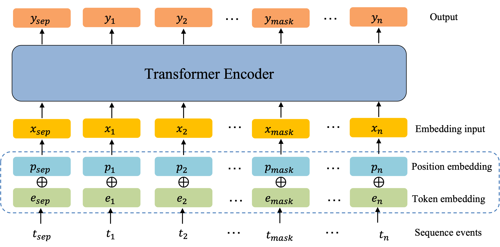

# Sequence events learning via BERT

This repository provides the implementation of Bert for sequence anomaly detection. 



## Configuration
- Ubuntu 20.04
- NVIDIA driver 460.73.01 
- CUDA 11.2
- Python 3.8
- PyTorch 1.9.0

## Installation
This code requires the packages listed in requirements.txt.
An virtual environment is recommended to run this code

On macOS and Linux:  
```
python3 -m pip install --user virtualenv
python3 -m venv env
source env/bin/activate
pip install -r ./environment/requirements.txt
deactivate
```
Reference: https://packaging.python.org/guides/installing-using-pip-and-virtual-environments/

An alternative is to create a conda environment:
```
conda create -f ./environment/environment.yml
conda activate brave
```
Reference: https://docs.conda.io/en/latest/miniconda.html

## Experiment

### Pretrain
```shell script

#run bert pretraining
python ehr-bert.py vocab
python ehr-bert.py train

```

### Folders created during execution
```shell script 
project/output //Stores intermediate files and final results during execution
```
